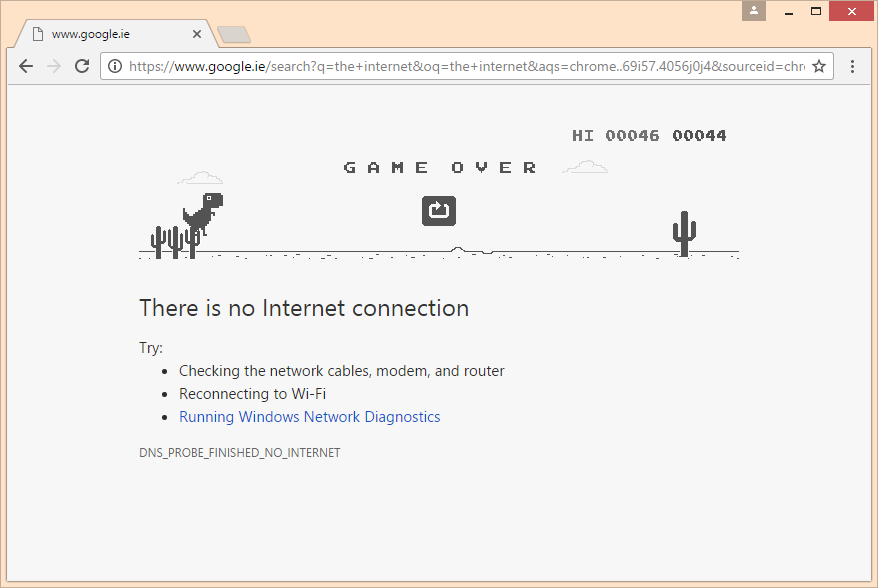

# Introduction

If you have ever had to suffer through an internet dropout, chances are you will have seen this page on Google Chrome.

What you might not know is that pressing the spacebar starts up a little jumping game!

Pressing the spacebar makes the Dino jump so that it can avoid the pesky cacti that get in its way.

This first lesson will show how you can re-create this game in the Pico-8 Engine!

  The full game is available [here](resources/pico_8_carts/OfflineDino.p8)
  
  You can load this game up by copying the p8 file into your 'Carts' folder, then typing 'load offlinedino' into the pico-8 Console

  

1. In the Pico-8 Program, press the ESC button to jump from the Console Window to the Pico-8 Editor

2. 
